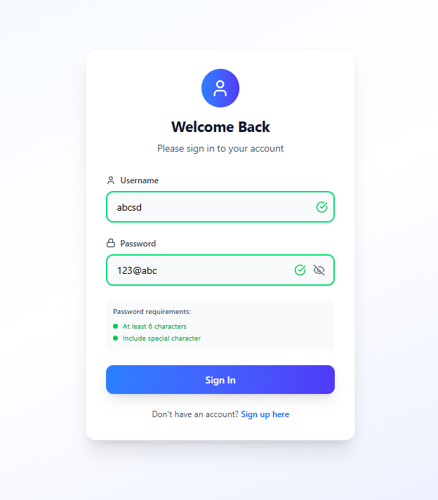
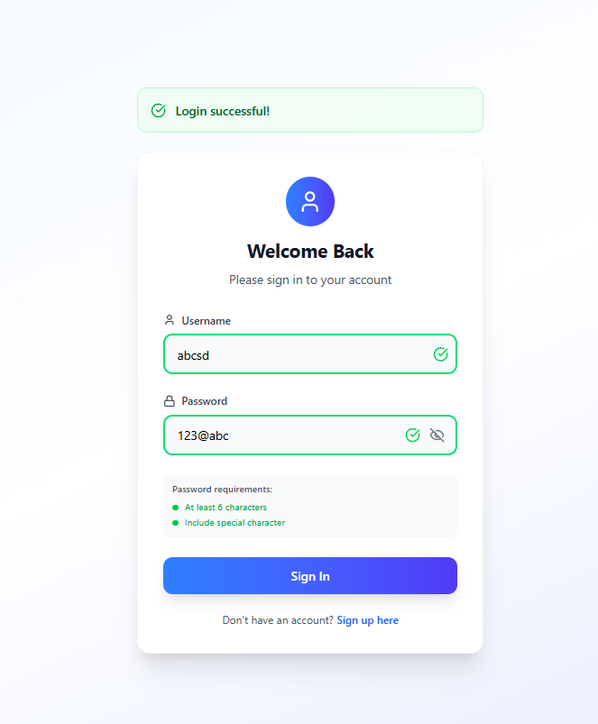

# 🔐 User Login Form (React + TypeScript + Tailwind)

A modern, responsive **user login form** built with **React, TypeScript, TailwindCSS, and Vite**.  
This project demonstrates real-time validation, error handling, and a smooth user experience with animations and icons.

---

## Demo
  [Demo](https://user-login-rouge.vercel.app/)

---

## ✨ Features

- ✅ Username & password validation (live error feedback)  
- ✅ Password strength hints (length + special character check)  
- ✅ Show/Hide password toggle  
- ✅ Animated success & error messages  
- ✅ Responsive, modern UI with TailwindCSS  
- ✅ Clean TypeScript & React Hooks implementation  

---

## 🛠 Tech Stack

- **Frontend:** React 19, TypeScript, Vite  
- **Styling:** TailwindCSS 4, Lucide Icons  
- **Linting:** ESLint + TypeScript ESLint  

---

## 📦 Installation

1. Clone the repo:
   ```bash
   git clone https://github.com/jayant880/User-Login.git
   cd User-Login
   ```
2.  Install dependencies
    ```bash
    npm install
    ```
3. Run the devlopment server:
    ```bash
    npm run dev
    ```
4. open the browser `http://localhost:5173`

## Preview

### Login Page

---
### Validatation State

---
### Success State

---
### Error State


---

## Project structure

```pgsql
User-Login/
├── src/
│   ├── Components/
│   │   └── UserForm.tsx   # Main login form component
│   ├── App.tsx            # App wrapper
│   ├── index.tsx          # Entry point
│   └── index.css          # Tailwind styles
├── package.json
├── tsconfig.json
└── vite.config.ts
```